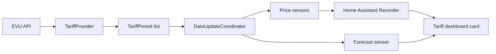

# Architecture

This document describes the stable structure and data contracts of Swiss
Dynamic Tariffs. Design choices and their alternatives are recorded separately
under [`docs/adr`](adr/).

## Project intent

The integration exists to make Swiss dynamic tariffs usable for practical home
automation and load-shifting experiments. Its motivating engineering thesis is
that sufficiently broad, price-responsive consumption can lower coincident
peaks and avoid or defer substantial reinforcement of distribution grid levels
5 and 7.

The software cannot measure or guarantee that system-level outcome. Adoption,
local bottlenecks, simultaneous customer behaviour and the network operator's
planning criteria remain outside the integration. The technical design
therefore concentrates on a narrower contribution: exposing provider data
faithfully, transparently and in a form that Home Assistant automations can
use.

## Responsibilities

The integration has three boundaries:

1. **Providers** translate external EVU APIs into a common tariff model.
2. **Home Assistant entities** expose current, derived and forecast values.
3. **The frontend** presents recorded and forecast values without changing the
   tariff data.

Keeping these boundaries separate allows a provider to be added without
rewriting the coordinator, sensors or dashboard.



## Backend data flow

### Provider layer

`providers/base.py` defines the `TariffProvider` contract. Implementations:

- perform asynchronous network requests;
- parse provider-specific payloads;
- return timezone-aware `TariffPeriod` objects;
- populate only price components supplied by the provider;
- express prices in CHF/kWh.

`providers/registry.py` is the single source of truth for configuration-flow
options. A tariff variant gets its own `TariffOption`, even when it shares a
provider implementation with other variants.

### Common model

`models.py` defines `TariffPeriod`. Each period has an exact `start`, `end` and
optional values for:

- `electricity`;
- `feed_in`;
- `grid_usage`;
- `grid`;
- `integrated`.

Missing components remain `None`. They are never inferred from unrelated
values.

### Coordinator

`coordinator.py` refreshes provider data every 15 minutes and supplies all
entities from one cached response.

New provider data is merged with previously fetched periods that have not
ended. This specifically prevents the active BKW period from disappearing when
the endpoint switches to a newly published day. Expired periods are not kept in
the coordinator; historical retention belongs to Home Assistant Recorder.

Derived minimum, maximum and average values use periods that have not ended, so
their results remain actionable.

## Entity contracts

`sensor.py` creates five sensors for every component supported by the provider:

- current;
- next;
- minimum;
- maximum;
- average.

Unique IDs contain the config-entry ID, component and sensor role. Existing
unique IDs are a compatibility contract and must not be renamed.

Price sensor attributes include:

| Attribute          | Purpose                                                     |
| ------------------ | ----------------------------------------------------------- |
| `start`, `end`     | Exact period represented by the state, when applicable.     |
| `tariff_component` | Component represented by the entity.                        |
| `tariff_role`      | Current, next, minimum, maximum or average role.            |
| `tariff_entry_id`  | Stable link between entities belonging to one tariff entry. |

The forecast sensor exposes all future periods under `prices`. Its state is the
sum of their durations in hours. `tariff_entry_id` links it to the corresponding
current-price sensors without depending on user-editable entity IDs or names.

The linking attributes are intentionally data, not presentation: the frontend
can discover renamed entities while provider and entity code remain unaware of
dashboard layout.

## Frontend data flow

The bundled JavaScript registers:

- a custom tariff card;
- the automatic sidebar panel;
- a dashboard strategy;
- card-picker metadata.

For each card:

1. Forecast periods are parsed from the forecast sensor.
2. Current-price sensors belonging to the same `tariff_entry_id` are found.
3. Home Assistant History is queried for the current day.
4. Historical states are converted using their recorded `start`/`end`
   attributes.
5. History and forecast periods are merged by exact start/end timestamp.
6. The result is split into calendar days in the configured Home Assistant
   timezone.

The later data source wins during a merge. Forecast data is applied after
history, making the latest provider payload authoritative if both sources cover
the same period.

History loading is cached by date, entity ID and current period start. This
avoids a Recorder query for every Home Assistant state refresh while ensuring a
new query occurs when the active quarter-hour changes.

History is optional. If the endpoint is unavailable or Recorder excludes the
current-price sensors, the card continues with forecast data only.

See
[ADR 0001: Dashboard time-series composition](adr/0001-dashboard-time-series.md)
for the rationale and alternatives.

## Time and forecast horizon

All comparisons use absolute timestamps. Calendar grouping and labels use
Home Assistant's configured timezone.

Today and tomorrow are always available as navigation choices. Additional
buttons are created for every further date present in the provider data; there
is no hard-coded 24-hour forecast limit.

The chart deliberately has a maximum width and height. A larger SVG did not add
information but reduced the readability of quarter-hour steps and labels on
wide dashboards.

## Frontend state preservation

The card is re-rendered when Home Assistant state changes. User interaction is
stored on the card instance:

- selected day;
- expanded/collapsed table state.

These values are read before replacing the shadow DOM and applied to the new
markup, preventing automatic updates from resetting the interface.

## Error handling

- Provider failures become `UpdateFailed` and preserve coordinator semantics.
- Initial provider failures raise `ConfigEntryNotReady`.
- A missing History response affects only past chart values.
- Missing values for a selected day produce an explicit empty state.
- Unsupported price components are omitted rather than displayed as zero.

## Frontend delivery and caching

The JavaScript file is served through Home Assistant's static-path support. The
query-string cache key is read from `manifest.json`, so every integration
version loads a matching frontend bundle. The version must be increased for
each published code change.

## Validation

The required local checks are:

```bash
pre-commit run --all-files
pytest --cov=custom_components.swiss_dynamic_tariffs
node --check custom_components/swiss_dynamic_tariffs/frontend/swiss-dynamic-tariffs.js
```

GitHub Actions additionally runs HACS and Hassfest validation. A `v*` tag
triggers the release workflow, which verifies the tag/version match and builds
the HACS ZIP.
